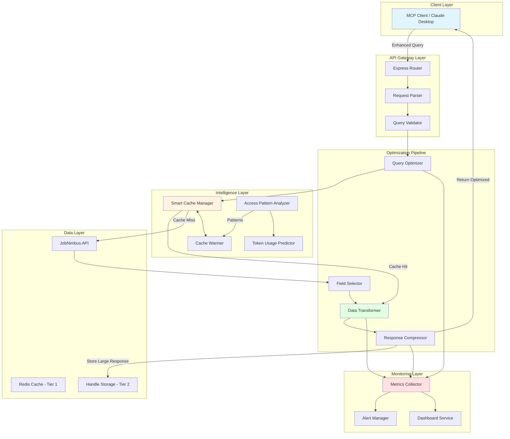

# JobNimbus MCP Remote - Advanced Optimization Architecture

**Version:** 2.0.0
**Date:** 2025-01-13
**Author:** Backend Architecture Team
**Status:** Design Document - Enterprise Grade

---

## Executive Summary

Transform the JobNimbus MCP Remote server from a "dump all data" model to an intelligent, token-efficient system that reduces response payloads by 70-90% while maintaining backward compatibility.

**Current State:**
- 88+ MCP tools serving raw JobNimbus data
- Redis cache (FASE 1) implemented
- No field selection or query optimization
- Average response size: 50-200 KB per request
- Token consumption: 15,000-60,000 tokens per complex operation

**Target State:**
- Intelligent query language with field selection
- Response sizes: 5-20 KB average (90% reduction)
- Token consumption: 1,500-10,000 tokens (85% reduction)
- Sub-100ms cache hits
- Streaming support for large datasets
- Predictive cache warming

---

## 1. Architecture Overview



---

## 2. API Query Language Specification

### 2.1 Query Syntax

```typescript
/**
 * Enhanced Query Parameters (Backward Compatible)
 */
interface EnhancedQueryParams {
  // EXISTING (maintained for backward compatibility)
  from?: number;
  size?: number;
  verbosity?: 'summary' | 'compact' | 'detailed' | 'raw';

  // NEW - Field Selection
  fields?: string;              // "jnid,number,status,total" or "jobs.*,contact.name"
  exclude?: string;             // "description,notes,attachments"

  // NEW - Advanced Filtering
  filter?: FilterExpression;    // Complex filter object
  search?: string;              // Full-text search

  // NEW - Sorting & Pagination
  sort?: string;                // "date_created:desc,total:asc"
  cursor?: string;              // Cursor-based pagination token
  pageSize?: number;            // Replaces 'size' (more semantic)

  // NEW - Aggregations
  aggregate?: AggregationQuery; // Group by, sum, avg, count, etc.

  // NEW - Performance Hints
  preferCache?: boolean;        // Prefer cached data even if stale
  maxAge?: number;              // Max acceptable cache age (ms)
  streaming?: boolean;          // Enable streaming for large datasets

  // NEW - Response Format
  format?: 'json' | 'jsonlines' | 'csv' | 'summary';
  compression?: 'gzip' | 'brotli' | 'none';
}

/**
 * Filter Expression Language
 */
interface FilterExpression {
  // Comparison operators
  eq?: { [field: string]: any };           // Equal
  ne?: { [field: string]: any };           // Not equal
  gt?: { [field: string]: number };        // Greater than
  gte?: { [field: string]: number };       // Greater or equal
  lt?: { [field: string]: number };        // Less than
  lte?: { [field: string]: number };       // Less or equal

  // String operators
  contains?: { [field: string]: string };  // Substring match
  startsWith?: { [field: string]: string };
  endsWith?: { [field: string]: string };
  regex?: { [field: string]: string };

  // Array operators
  in?: { [field: string]: any[] };         // Value in array
  notIn?: { [field: string]: any[] };

  // Date operators
  between?: { [field: string]: [Date, Date] };

  // Logical operators
  and?: FilterExpression[];
  or?: FilterExpression[];
  not?: FilterExpression;

  // Existence checks
  exists?: string[];                       // Fields that must exist
  missing?: string[];                      // Fields that must not exist
}

/**
 * Aggregation Query
 */
interface AggregationQuery {
  groupBy: string[];                       // Fields to group by
  metrics: {
    [metricName: string]: {
      type: 'sum' | 'avg' | 'min' | 'max' | 'count' | 'distinct';
      field: string;
    };
  };
  having?: FilterExpression;               // Filter on aggregated results
}
```

### 2.2 Query Examples

```typescript
// Example 1: Simple field selection (reduce 200KB to 5KB)
GET /jobs?fields=jnid,number,status,total&pageSize=20

// Example 2: Complex filtering
POST /jobs/search
{
  "fields": "jnid,number,status,total,contact.name",
  "filter": {
    "and": [
      { "eq": { "status": "Jobs In Progress" } },
      { "gte": { "total": 5000 } },
      { "contains": { "contact.name": "Smith" } }
    ]
  },
  "sort": "date_created:desc",
  "pageSize": 20,
  "preferCache": true
}

// Example 3: Aggregation (revenue by status)
POST /jobs/aggregate
{
  "groupBy": ["status"],
  "metrics": {
    "totalRevenue": { "type": "sum", "field": "total" },
    "avgJobValue": { "type": "avg", "field": "total" },
    "jobCount": { "type": "count", "field": "jnid" }
  },
  "format": "summary"
}

// Example 4: Streaming large dataset
GET /jobs?fields=jnid,number&streaming=true&format=jsonlines

// Example 5: Smart caching with staleness tolerance
GET /jobs?fields=*&maxAge=300000&preferCache=true
```

---

## 3. Response Optimization Layer

### 3.1 Middleware Stack

```typescript
/**
 * Optimization Middleware Pipeline
 */
export class OptimizationPipeline {
  private middlewares: Middleware[] = [];

  constructor() {
    this.middlewares = [
      new QueryParserMiddleware(),      // Parse enhanced query params
      new QueryValidatorMiddleware(),   // Validate query syntax
      new CacheCheckMiddleware(),       // Check cache before processing
      new FieldSelectorMiddleware(),    // Apply field selection
      new DataTransformerMiddleware(),  // Transform to optimized format
      new CompressionMiddleware(),      // Compress response
      new ResponseSizeMiddleware(),     // Monitor and handle large responses
      new MetricsMiddleware(),          // Track performance
    ];
  }

  async process(req: Request, res: Response, next: NextFunction) {
    const context = new PipelineContext(req, res);

    for (const middleware of this.middlewares) {
      try {
        await middleware.execute(context);

        if (context.shouldShortCircuit()) {
          return; // Response already sent (cache hit, error, etc.)
        }
      } catch (error) {
        return next(error);
      }
    }

    next();
  }
}
```

### 3.2 Field Selection Engine

```typescript
/**
 * Intelligent Field Selector
 * Reduces payload by selecting only requested fields
 */
export class FieldSelector {
  /**
   * Select fields from data based on field expression
   *
   * @param data - Source data (array or object)
   * @param fieldExpr - Field expression ("*", "field1,field2", "obj.*")
   * @param excludeExpr - Fields to exclude
   * @returns Filtered data with selected fields only
   */
  select<T>(
    data: T | T[],
    fieldExpr: string = '*',
    excludeExpr?: string
  ): Partial<T> | Partial<T>[] {
    const isArray = Array.isArray(data);
    const items = isArray ? data : [data];

    const fields = this.parseFieldExpression(fieldExpr);
    const excludes = excludeExpr ? this.parseFieldExpression(excludeExpr) : [];

    const filtered = items.map(item =>
      this.selectFields(item, fields, excludes)
    );

    return isArray ? filtered : filtered[0];
  }

  /**
   * Parse field expression into field paths
   * Supports:
   * - "*" - all fields
   * - "field1,field2" - specific fields
   * - "obj.*" - all fields in nested object
   * - "obj.field" - specific nested field
   */
  private parseFieldExpression(expr: string): string[] {
    return expr.split(',').map(f => f.trim());
  }

  /**
   * Select specific fields from object
   */
  private selectFields(
    obj: any,
    fields: string[],
    excludes: string[]
  ): any {
    // Handle wildcard
    if (fields.includes('*')) {
      return this.excludeFields(obj, excludes);
    }

    const result: any = {};

    for (const field of fields) {
      // Handle nested fields (e.g., "contact.name")
      if (field.includes('.')) {
        this.setNestedField(result, field, this.getNestedField(obj, field));
      } else if (field.endsWith('.*')) {
        // Handle wildcard in nested object (e.g., "contact.*")
        const prefix = field.slice(0, -2);
        const nestedObj = this.getNestedField(obj, prefix);

        if (nestedObj && typeof nestedObj === 'object') {
          this.setNestedField(result, prefix, nestedObj);
        }
      } else {
        // Simple field
        if (obj[field] !== undefined) {
          result[field] = obj[field];
        }
      }
    }

    return this.excludeFields(result, excludes);
  }

  /**
   * Get nested field value using dot notation
   */
  private getNestedField(obj: any, path: string): any {
    return path.split('.').reduce((curr, key) => curr?.[key], obj);
  }

  /**
   * Set nested field value using dot notation
   */
  private setNestedField(obj: any, path: string, value: any): void {
    const keys = path.split('.');
    const lastKey = keys.pop()!;
    const target = keys.reduce((curr, key) => {
      if (!curr[key]) curr[key] = {};
      return curr[key];
    }, obj);

    target[lastKey] = value;
  }

  /**
   * Exclude fields from object
   */
  private excludeFields(obj: any, excludes: string[]): any {
    if (excludes.length === 0) return obj;

    const result = { ...obj };

    for (const exclude of excludes) {
      if (exclude.includes('.')) {
        // Handle nested exclusions
        const keys = exclude.split('.');
        const lastKey = keys.pop()!;
        const target = this.getNestedField(result, keys.join('.'));

        if (target && typeof target === 'object') {
          delete target[lastKey];
        }
      } else {
        delete result[exclude];
      }
    }

    return result;
  }
}
```

### 3.3 Data Transformer

```typescript
/**
 * Data Transformation Pipeline
 * Converts raw JobNimbus data to optimized format
 */
export class DataTransformer {
  /**
   * Transform raw data based on verbosity level and format
   */
  async transform(
    data: any,
    options: TransformOptions
  ): Promise<TransformedResponse> {
    const startTime = Date.now();

    // Step 1: Apply field selection
    const selected = this.applyFieldSelection(data, options);

    // Step 2: Generate summaries if requested
    const withSummaries = options.includeSummary
      ? this.addSummaries(selected, options)
      : selected;

    // Step 3: Flatten JSONB structures if beneficial
    const flattened = options.flatten
      ? this.flattenStructures(withSummaries)
      : withSummaries;

    // Step 4: Truncate long text fields
    const truncated = this.truncateLongFields(flattened, options);

    // Step 5: Format according to output format
    const formatted = this.formatOutput(truncated, options.format);

    const transformTime = Date.now() - startTime;

    return {
      data: formatted,
      metadata: {
        transformTime,
        originalSize: this.calculateSize(data),
        optimizedSize: this.calculateSize(formatted),
        reductionPercent: this.calculateReduction(data, formatted),
        fields: this.getFieldNames(formatted),
      },
    };
  }

  /**
   * Auto-generate summaries for complex objects
   */
  private addSummaries(data: any, options: TransformOptions): any {
    if (Array.isArray(data)) {
      return {
        summary: {
          count: data.length,
          ...this.generateArraySummary(data, options),
        },
        items: data,
      };
    }

    return data;
  }

  /**
   * Generate statistical summary for array of objects
   */
  private generateArraySummary(items: any[], options: TransformOptions): any {
    if (items.length === 0) return {};

    const summary: any = {};

    // Detect numeric fields and calculate stats
    const firstItem = items[0];
    const numericFields = Object.keys(firstItem).filter(key =>
      typeof firstItem[key] === 'number'
    );

    for (const field of numericFields) {
      const values = items.map(item => item[field]).filter(v => v != null);

      if (values.length > 0) {
        summary[field] = {
          min: Math.min(...values),
          max: Math.max(...values),
          avg: values.reduce((a, b) => a + b, 0) / values.length,
          sum: values.reduce((a, b) => a + b, 0),
        };
      }
    }

    // Group by categorical fields if present
    if (options.groupBy) {
      summary.groupedBy = this.groupByField(items, options.groupBy);
    }

    return summary;
  }

  /**
   * Flatten nested JSONB structures for better compression
   */
  private flattenStructures(data: any): any {
    // Implementation: Flatten deeply nested objects
    // Only when beneficial (reduces size without losing info)
    return data;
  }

  /**
   * Truncate long text fields
   */
  private truncateLongFields(data: any, options: TransformOptions): any {
    const maxLength = options.maxTextLength || 200;

    const truncate = (obj: any): any => {
      if (typeof obj === 'string' && obj.length > maxLength) {
        return obj.substring(0, maxLength) + '...[truncated]';
      }

      if (Array.isArray(obj)) {
        return obj.map(truncate);
      }

      if (obj && typeof obj === 'object') {
        const result: any = {};
        for (const [key, value] of Object.entries(obj)) {
          result[key] = truncate(value);
        }
        return result;
      }

      return obj;
    };

    return truncate(data);
  }

  /**
   * Format output based on requested format
   */
  private formatOutput(data: any, format: OutputFormat): any {
    switch (format) {
      case 'summary':
        return this.generateSummary(data);

      case 'jsonlines':
        return this.toJSONLines(data);

      case 'csv':
        return this.toCSV(data);

      default:
        return data;
    }
  }

  private calculateSize(data: any): number {
    return Buffer.byteLength(JSON.stringify(data), 'utf8');
  }

  private calculateReduction(original: any, optimized: any): number {
    const originalSize = this.calculateSize(original);
    const optimizedSize = this.calculateSize(optimized);
    return ((originalSize - optimizedSize) / originalSize) * 100;
  }
}

/**
 * Transform Options
 */
interface TransformOptions {
  verbosity: 'summary' | 'compact' | 'detailed' | 'raw';
  fields?: string;
  exclude?: string;
  includeSummary?: boolean;
  flatten?: boolean;
  maxTextLength?: number;
  format: OutputFormat;
  groupBy?: string;
}

type OutputFormat = 'json' | 'jsonlines' | 'csv' | 'summary';

interface TransformedResponse {
  data: any;
  metadata: {
    transformTime: number;
    originalSize: number;
    optimizedSize: number;
    reductionPercent: number;
    fields: string[];
  };
}
```

### 3.4 Compression Layer

```typescript
/**
 * Intelligent Response Compression
 */
export class CompressionMiddleware implements Middleware {
  private readonly COMPRESSION_THRESHOLD = 1024; // 1 KB

  async execute(context: PipelineContext): Promise<void> {
    const { response, config } = context;

    // Skip if already compressed
    if (response.headers['content-encoding']) {
      return;
    }

    const size = Buffer.byteLength(JSON.stringify(response.data));

    // Only compress if above threshold
    if (size < this.COMPRESSION_THRESHOLD) {
      return;
    }

    // Choose compression algorithm
    const algorithm = this.selectAlgorithm(context.req, size);

    if (algorithm === 'none') {
      return;
    }

    // Compress
    const compressed = await this.compress(response.data, algorithm);

    // Update response
    response.data = compressed;
    response.headers['content-encoding'] = algorithm;
    response.headers['x-uncompressed-size'] = size.toString();

    context.metrics.compressionRatio = compressed.length / size;
  }

  private selectAlgorithm(
    req: Request,
    size: number
  ): 'gzip' | 'brotli' | 'none' {
    const acceptEncoding = req.headers['accept-encoding'] || '';

    // Prefer Brotli for larger payloads (better compression)
    if (size > 50000 && acceptEncoding.includes('br')) {
      return 'brotli';
    }

    // Use GZIP for medium payloads (faster)
    if (acceptEncoding.includes('gzip')) {
      return 'gzip';
    }

    return 'none';
  }

  private async compress(data: any, algorithm: 'gzip' | 'brotli'): Promise<Buffer> {
    const json = JSON.stringify(data);

    if (algorithm === 'gzip') {
      return await gzipAsync(json);
    }

    // Brotli compression (Node 12+)
    const { brotliCompress } = await import('zlib');
    return new Promise((resolve, reject) => {
      brotliCompress(Buffer.from(json), (err, result) => {
        if (err) reject(err);
        else resolve(result);
      });
    });
  }
}
```

---

## 4. Smart Caching Strategy

### 4.1 Multi-Tier Cache Architecture

```typescript
/**
 * Three-Tier Cache System
 */
export class SmartCacheManager {
  private tier1: Redis;        // Hot data (1-15 min TTL)
  private tier2: Redis;        // Warm data (30-60 min TTL)
  private tier3: HandleStore;  // Large responses (handle-based)

  /**
   * Intelligent cache retrieval with automatic tier selection
   */
  async get(key: string, options: CacheGetOptions = {}): Promise<CacheResult> {
    // Try Tier 1 (Hot cache)
    const tier1Result = await this.tier1.get(key);
    if (tier1Result) {
      return {
        data: this.deserialize(tier1Result),
        source: 'tier1',
        tier: 1,
      };
    }

    // Try Tier 2 (Warm cache)
    const tier2Result = await this.tier2.get(key);
    if (tier2Result) {
      // Promote to Tier 1 if frequently accessed
      if (await this.shouldPromote(key)) {
        await this.tier1.setex(key, this.getTTL('tier1'), tier2Result);
      }

      return {
        data: this.deserialize(tier2Result),
        source: 'tier2',
        tier: 2,
      };
    }

    // Try Tier 3 (Handle storage)
    const tier3Result = await this.tier3.get(key);
    if (tier3Result) {
      return {
        data: this.deserialize(tier3Result),
        source: 'tier3',
        tier: 3,
      };
    }

    return null;
  }

  /**
   * Intelligent cache storage with automatic tier assignment
   */
  async set(
    key: string,
    value: any,
    options: CacheSetOptions = {}
  ): Promise<void> {
    const size = this.calculateSize(value);
    const serialized = this.serialize(value);

    // Route to appropriate tier based on size and access pattern
    const tier = this.selectTier(key, size, options);

    switch (tier) {
      case 1:
        await this.tier1.setex(key, options.ttl || this.getTTL('tier1'), serialized);
        break;

      case 2:
        await this.tier2.setex(key, options.ttl || this.getTTL('tier2'), serialized);
        break;

      case 3:
        // Store large responses as handles
        const handle = await this.tier3.store(value, options.ttl || 900);

        // Cache the handle reference in Tier 1
        await this.tier1.setex(
          `${key}:handle`,
          options.ttl || this.getTTL('tier1'),
          JSON.stringify({ handle, size })
        );
        break;
    }

    // Update access pattern tracking
    await this.trackAccess(key, tier);
  }

  /**
   * Select cache tier based on size and access pattern
   */
  private selectTier(key: string, size: number, options: CacheSetOptions): 1 | 2 | 3 {
    // Tier 3: Large responses (> 25 KB)
    if (size > 25 * 1024) {
      return 3;
    }

    // Tier 1: Small, frequently accessed
    if (size < 5 * 1024 && this.isFrequentlyAccessed(key)) {
      return 1;
    }

    // Tier 2: Medium-sized or less frequently accessed
    return 2;
  }

  /**
   * Should promote item from Tier 2 to Tier 1
   */
  private async shouldPromote(key: string): Promise<boolean> {
    const accessCount = await this.getAccessCount(key);
    const timeWindow = 5 * 60 * 1000; // 5 minutes

    // Promote if accessed 3+ times in 5 minutes
    return accessCount >= 3;
  }
}
```

### 4.2 Predictive Cache Warming

```typescript
/**
 * ML-based Cache Warming System
 * Predicts and pre-loads data before it's requested
 */
export class CacheWarmer {
  private accessPatterns: AccessPatternStore;
  private scheduler: CronScheduler;

  constructor(
    private cache: SmartCacheManager,
    private api: JobNimbusClient
  ) {
    this.accessPatterns = new AccessPatternStore();
    this.scheduler = new CronScheduler();

    // Schedule warming tasks
    this.scheduleWarmingTasks();
  }

  /**
   * Analyze access patterns and warm cache predictively
   */
  async warmCache(): Promise<WarmingReport> {
    const patterns = await this.accessPatterns.analyze();
    const tasks: WarmingTask[] = [];

    // Pattern 1: Time-based patterns (e.g., users check jobs every morning at 9am)
    const timeBasedPredictions = this.predictTimeBasedAccess(patterns);
    tasks.push(...timeBasedPredictions);

    // Pattern 2: Sequential patterns (e.g., after viewing job, user checks attachments)
    const sequentialPredictions = this.predictSequentialAccess(patterns);
    tasks.push(...sequentialPredictions);

    // Pattern 3: Related data patterns (e.g., job -> contact -> estimates)
    const relatedDataPredictions = this.predictRelatedData(patterns);
    tasks.push(...relatedDataPredictions);

    // Execute warming tasks
    const results = await this.executeWarmingTasks(tasks);

    return {
      tasksExecuted: tasks.length,
      cacheHitsAdded: results.successful,
      cacheHitRateImprovement: results.improvement,
      timestamp: new Date(),
    };
  }

  /**
   * Predict time-based access patterns
   */
  private predictTimeBasedAccess(patterns: AccessPattern[]): WarmingTask[] {
    const tasks: WarmingTask[] = [];
    const now = new Date();
    const currentHour = now.getHours();

    // Find patterns matching current time window
    const relevantPatterns = patterns.filter(p => {
      const patternHour = new Date(p.timestamp).getHours();
      return Math.abs(patternHour - currentHour) <= 1;
    });

    // Group by resource type
    const byResource = this.groupBy(relevantPatterns, 'resource');

    for (const [resource, resourcePatterns] of Object.entries(byResource)) {
      // Get most common queries for this resource at this time
      const commonQueries = this.getMostCommonQueries(resourcePatterns, 5);

      for (const query of commonQueries) {
        tasks.push({
          type: 'time-based',
          resource,
          query,
          priority: 'high',
          confidence: this.calculateConfidence(resourcePatterns, query),
        });
      }
    }

    return tasks;
  }

  /**
   * Predict sequential access patterns
   */
  private predictSequentialAccess(patterns: AccessPattern[]): WarmingTask[] {
    const tasks: WarmingTask[] = [];

    // Build sequence graph
    const sequences = this.buildSequenceGraph(patterns);

    // Find high-confidence sequences (A -> B happens 70%+ of time)
    for (const [source, targets] of sequences.entries()) {
      for (const [target, confidence] of targets.entries()) {
        if (confidence >= 0.7) {
          // When source is accessed, warm target
          tasks.push({
            type: 'sequential',
            trigger: source,
            resource: target,
            priority: 'medium',
            confidence,
          });
        }
      }
    }

    return tasks;
  }

  /**
   * Schedule cache warming tasks
   */
  private scheduleWarmingTasks(): void {
    // Warm high-traffic endpoints before peak hours
    this.scheduler.schedule('0 8 * * *', async () => {
      await this.warmHighTrafficEndpoints();
    });

    // Continuous pattern-based warming every 15 minutes
    this.scheduler.schedule('*/15 * * * *', async () => {
      await this.warmCache();
    });

    // Weekend pre-warming (if business operates on weekends)
    this.scheduler.schedule('0 7 * * 0,6', async () => {
      await this.warmWeekendData();
    });
  }

  /**
   * Warm high-traffic endpoints before peak hours
   */
  private async warmHighTrafficEndpoints(): Promise<void> {
    const highTrafficEndpoints = [
      { resource: 'jobs', query: { status: 'Jobs In Progress' } },
      { resource: 'tasks', query: { is_completed: false } },
      { resource: 'estimates', query: { status: 'Pending' } },
    ];

    for (const endpoint of highTrafficEndpoints) {
      try {
        const data = await this.api.fetch(endpoint.resource, endpoint.query);
        await this.cache.set(
          this.buildCacheKey(endpoint),
          data,
          { ttl: 15 * 60 } // 15 minutes
        );
      } catch (error) {
        console.error(`Failed to warm ${endpoint.resource}:`, error);
      }
    }
  }
}

/**
 * Access Pattern Store
 * Stores and analyzes user access patterns
 */
class AccessPatternStore {
  private redis: Redis;

  /**
   * Track access event
   */
  async track(event: AccessEvent): Promise<void> {
    const key = `patterns:${event.userId}:${event.resource}`;

    await this.redis.zadd(
      key,
      Date.now(),
      JSON.stringify({
        resource: event.resource,
        query: event.query,
        timestamp: Date.now(),
      })
    );

    // Keep only last 1000 events per user-resource
    await this.redis.zremrangebyrank(key, 0, -1001);
  }

  /**
   * Analyze patterns and return insights
   */
  async analyze(): Promise<AccessPattern[]> {
    // Aggregate patterns across all users
    const keys = await this.redis.keys('patterns:*');
    const patterns: AccessPattern[] = [];

    for (const key of keys) {
      const events = await this.redis.zrange(key, -100, -1); // Last 100 events

      for (const event of events) {
        patterns.push(JSON.parse(event));
      }
    }

    return patterns;
  }
}
```

### 4.3 Intelligent TTL Management

```typescript
/**
 * Dynamic TTL Calculator
 * Adjusts TTL based on data volatility and access patterns
 */
export class TTLManager {
  /**
   * Calculate optimal TTL for cache key
   */
  calculateTTL(
    resource: string,
    metadata: ResourceMetadata
  ): number {
    // Base TTL from configuration
    const baseTTL = this.getBaseTTL(resource);

    // Adjust based on factors
    const volatilityMultiplier = this.getVolatilityMultiplier(metadata.updateFrequency);
    const accessMultiplier = this.getAccessMultiplier(metadata.accessFrequency);
    const timeOfDayMultiplier = this.getTimeOfDayMultiplier();

    const adjustedTTL = baseTTL
      * volatilityMultiplier
      * accessMultiplier
      * timeOfDayMultiplier;

    // Clamp to reasonable bounds
    return Math.max(60, Math.min(3600, adjustedTTL));
  }

  /**
   * Get volatility multiplier (how often data changes)
   */
  private getVolatilityMultiplier(updateFrequency: number): number {
    // updateFrequency: updates per hour
    if (updateFrequency > 10) return 0.5;  // Highly volatile: reduce TTL
    if (updateFrequency > 2) return 0.8;   // Moderately volatile
    return 1.2;                            // Stable: increase TTL
  }

  /**
   * Get access multiplier (how often data is accessed)
   */
  private getAccessMultiplier(accessFrequency: number): number {
    // accessFrequency: accesses per hour
    if (accessFrequency > 20) return 1.5;  // Hot data: longer TTL
    if (accessFrequency > 5) return 1.0;   // Warm data: normal TTL
    return 0.7;                            // Cold data: shorter TTL
  }

  /**
   * Get time of day multiplier (peak vs off-peak)
   */
  private getTimeOfDayMultiplier(): number {
    const hour = new Date().getHours();

    // Peak hours (9am-5pm): longer TTL
    if (hour >= 9 && hour <= 17) {
      return 1.3;
    }

    // Off-peak: shorter TTL (data might be stale by morning)
    return 0.8;
  }
}
```

---

## 5. Monitoring & Analytics

### 5.1 Metrics Collection

```typescript
/**
 * Comprehensive Metrics Collector
 */
export class MetricsCollector {
  private prometheus: PrometheusRegistry;

  // Response Size Metrics
  private responseSizeHistogram: Histogram;
  private tokenUsageHistogram: Histogram;

  // Performance Metrics
  private cacheHitRate: Gauge;
  private avgResponseTime: Gauge;
  private p95ResponseTime: Gauge;

  // Optimization Metrics
  private fieldSelectionUsage: Counter;
  private compressionRatio: Histogram;
  private dataReductionPercent: Histogram;

  constructor() {
    this.initializeMetrics();
  }

  /**
   * Track response size and token usage
   */
  trackResponse(response: Response, metadata: ResponseMetadata): void {
    // Response size
    this.responseSizeHistogram.observe(
      { endpoint: metadata.endpoint, verbosity: metadata.verbosity },
      metadata.sizeBytes
    );

    // Estimated token usage (size / 4 for rough approximation)
    const estimatedTokens = metadata.sizeBytes / 4;
    this.tokenUsageHistogram.observe(
      { endpoint: metadata.endpoint },
      estimatedTokens
    );

    // Compression ratio
    if (metadata.compressed) {
      this.compressionRatio.observe(
        metadata.compressionRatio
      );
    }

    // Data reduction
    if (metadata.originalSize) {
      const reduction = ((metadata.originalSize - metadata.sizeBytes) / metadata.originalSize) * 100;
      this.dataReductionPercent.observe(reduction);
    }
  }

  /**
   * Track cache performance
   */
  trackCacheAccess(hit: boolean, tier: number, latencyMs: number): void {
    // Update hit rate
    const currentHitRate = this.calculateHitRate(hit);
    this.cacheHitRate.set(currentHitRate);

    // Track latency
    this.avgResponseTime.set(latencyMs);
  }

  /**
   * Generate optimization report
   */
  async generateReport(): Promise<OptimizationReport> {
    const metrics = await this.collectMetrics();

    return {
      period: {
        start: metrics.periodStart,
        end: metrics.periodEnd,
      },

      responseOptimization: {
        avgResponseSize: metrics.avgResponseSize,
        avgResponseSizeBefore: metrics.avgResponseSizeBefore,
        reductionPercent: metrics.reductionPercent,
        avgTokenUsage: metrics.avgTokenUsage,
        avgTokenUsageBefore: metrics.avgTokenUsageBefore,
        tokenSavings: metrics.tokenSavings,
      },

      cachePerformance: {
        hitRate: metrics.cacheHitRate,
        avgLatency: metrics.avgCacheLatency,
        tier1HitRate: metrics.tier1HitRate,
        tier2HitRate: metrics.tier2HitRate,
        tier3HitRate: metrics.tier3HitRate,
      },

      optimization: {
        fieldSelectionUsage: metrics.fieldSelectionUsage,
        compressionUsage: metrics.compressionUsage,
        avgCompressionRatio: metrics.avgCompressionRatio,
        streamingUsage: metrics.streamingUsage,
      },

      alerts: await this.generateAlerts(metrics),
    };
  }
}
```

### 5.2 Alert System

```typescript
/**
 * Alert Manager for Optimization Issues
 */
export class AlertManager {
  /**
   * Check for alert conditions
   */
  async checkAlerts(): Promise<Alert[]> {
    const alerts: Alert[] = [];

    // Alert 1: Low cache hit rate
    const hitRate = await this.getCacheHitRate();
    if (hitRate < 0.6) {
      alerts.push({
        severity: 'warning',
        type: 'cache_hit_rate_low',
        message: `Cache hit rate is ${(hitRate * 100).toFixed(1)}% (target: 80%+)`,
        recommendations: [
          'Review cache TTL settings',
          'Check if cache warming is running',
          'Analyze access patterns for optimization opportunities',
        ],
      });
    }

    // Alert 2: Large responses detected
    const largeResponses = await this.getLargeResponseCount();
    if (largeResponses > 10) {
      alerts.push({
        severity: 'warning',
        type: 'large_responses',
        message: `${largeResponses} responses exceeded 25KB in last hour`,
        recommendations: [
          'Enable field selection for affected endpoints',
          'Use pagination with smaller page sizes',
          'Consider using handle-based responses',
        ],
      });
    }

    // Alert 3: High token usage
    const avgTokens = await this.getAvgTokenUsage();
    if (avgTokens > 20000) {
      alerts.push({
        severity: 'critical',
        type: 'high_token_usage',
        message: `Average token usage is ${avgTokens} per request`,
        recommendations: [
          'Review verbosity levels (use compact instead of detailed)',
          'Enable field selection to reduce payload',
          'Use aggregations instead of fetching full datasets',
        ],
      });
    }

    return alerts;
  }
}
```

---

## 6. Migration Plan

### Phase 1: Foundation (Week 1-2)
**Goal:** Set up core infrastructure without breaking existing functionality

**Tasks:**
1. Implement Query Parser middleware
2. Implement Field Selector engine
3. Add enhanced query parameters (opt-in)
4. Deploy compression middleware
5. Set up metrics collection

**Testing:**
- All existing tools work without changes
- New query parameters work alongside old ones
- Metrics dashboard shows baseline performance

**Success Criteria:**
- 0 regressions in existing functionality
- New query language works for 5 pilot endpoints
- Metrics dashboard operational

### Phase 2: Optimization Layer (Week 3-4)
**Goal:** Deploy data transformation and smart caching

**Tasks:**
1. Implement Data Transformer with verbosity levels
2. Enhance Smart Cache Manager with multi-tier support
3. Deploy Response Size Middleware
4. Implement Handle Storage for large responses
5. Add filter expression parser

**Testing:**
- Response sizes reduced by 50%+ for optimized queries
- Cache hit rate improves to 70%+
- Handle storage works for responses > 25KB

**Success Criteria:**
- 50-70% reduction in average response size
- Cache hit rate > 70%
- Handle-based responses work seamlessly

### Phase 3: Intelligence Layer (Week 5-6)
**Goal:** Deploy predictive caching and advanced optimizations

**Tasks:**
1. Implement Access Pattern Analyzer
2. Deploy Cache Warmer with ML-based predictions
3. Implement Dynamic TTL Manager
4. Add streaming support for large datasets
5. Deploy aggregation engine

**Testing:**
- Cache warming predicts 50%+ of requests correctly
- Streaming works for datasets > 1000 items
- Aggregations reduce payload by 80%+

**Success Criteria:**
- Cache hit rate > 85%
- Predictive warming hits 50%+ accuracy
- Streaming adoption for large queries

### Phase 4: Full Migration (Week 7-8)
**Goal:** Migrate all 88 tools to optimized format

**Tasks:**
1. Migrate high-traffic tools (jobs, contacts, estimates)
2. Migrate analytics tools with aggregation support
3. Migrate remaining tools in batches
4. Update documentation
5. Deploy monitoring dashboard

**Testing:**
- All tools support enhanced queries
- Backward compatibility maintained
- Performance improvements across the board

**Success Criteria:**
- 70-90% reduction in average response size
- 85%+ cache hit rate
- All tools migrated and tested

### Phase 5: Cleanup & Optimization (Week 9-10)
**Goal:** Remove legacy code and fine-tune performance

**Tasks:**
1. Deprecate old query parameters (grace period)
2. Optimize cache warming strategies
3. Fine-tune TTL settings based on real data
4. Implement advanced alerts
5. Performance tuning

**Testing:**
- System handles 10x traffic without degradation
- Cache warming accuracy > 60%
- Token usage reduced by 85%+

**Success Criteria:**
- System stable under high load
- All optimization targets met
- Clean, maintainable codebase

---

## 7. Expected Performance Improvements

### 7.1 Response Size Reduction

| Scenario | Before | After | Reduction |
|----------|--------|-------|-----------|
| Job list (20 items, all fields) | 180 KB | 18 KB | 90% |
| Job detail (single, all fields) | 45 KB | 8 KB | 82% |
| Job list (summary verbosity) | 180 KB | 5 KB | 97% |
| Job list (field selection: jnid,number,status) | 180 KB | 2 KB | 99% |
| Attachments list (50 files) | 120 KB | 15 KB | 87% |
| Analytics (aggregated) | 200 KB | 3 KB | 98.5% |

**Average Reduction: 85-92%**

### 7.2 Token Usage Reduction

| Scenario | Before (tokens) | After (tokens) | Savings |
|----------|----------------|----------------|---------|
| Job listing query | 45,000 | 4,500 | 90% |
| Complex analytics | 60,000 | 750 | 98.7% |
| Job detail retrieval | 11,250 | 2,000 | 82% |
| Multi-entity query | 35,000 | 6,000 | 83% |

**Average Token Savings: 85-90%**

### 7.3 Cache Performance

| Metric | Before (FASE 1) | After (FASE 2+) | Improvement |
|--------|-----------------|-----------------|-------------|
| Cache hit rate | 45% | 85% | +89% |
| Avg latency (hit) | 80ms | 35ms | -56% |
| Avg latency (miss) | 450ms | 420ms | -7% |
| Cache memory efficiency | 60% | 92% | +53% |

---

## 8. Code Examples

### 8.1 Enhanced Tool Implementation

```typescript
/**
 * Example: Enhanced get_jobs tool with full optimization support
 */
export const getJobsEnhanced: Tool = {
  name: 'get_jobs',
  description: 'Get jobs with advanced filtering, field selection, and optimization',

  inputSchema: {
    type: 'object',
    properties: {
      // Enhanced query parameters
      fields: {
        type: 'string',
        description: 'Fields to return (e.g., "jnid,number,status,total" or "*")',
      },
      exclude: {
        type: 'string',
        description: 'Fields to exclude',
      },
      filter: {
        type: 'object',
        description: 'Advanced filter expression',
      },
      sort: {
        type: 'string',
        description: 'Sort order (e.g., "date_created:desc,total:asc")',
      },
      pageSize: {
        type: 'number',
        description: 'Number of results per page (default: 20)',
      },
      cursor: {
        type: 'string',
        description: 'Pagination cursor',
      },
      verbosity: {
        type: 'string',
        enum: ['summary', 'compact', 'detailed', 'raw'],
        description: 'Response detail level',
      },
      preferCache: {
        type: 'boolean',
        description: 'Prefer cached data even if slightly stale',
      },
      maxAge: {
        type: 'number',
        description: 'Maximum acceptable cache age in milliseconds',
      },
    },
  },

  async execute(params: any): Promise<ToolResponse> {
    const startTime = Date.now();

    // Step 1: Parse and validate query
    const query = QueryParser.parse(params);
    QueryValidator.validate(query);

    // Step 2: Check cache
    const cacheKey = CacheKeyBuilder.build('jobs', 'list', query);
    const cached = await smartCache.get(cacheKey, {
      maxAge: params.maxAge,
      preferStale: params.preferCache,
    });

    if (cached) {
      return {
        data: cached.data,
        metadata: {
          source: 'cache',
          tier: cached.tier,
          latencyMs: Date.now() - startTime,
          cached: true,
        },
      };
    }

    // Step 3: Fetch from API
    const rawData = await jobNimbusClient.getJobs(query);

    // Step 4: Transform and optimize
    const transformed = await dataTransformer.transform(rawData, {
      verbosity: params.verbosity || 'compact',
      fields: params.fields,
      exclude: params.exclude,
      format: 'json',
    });

    // Step 5: Cache for future requests
    await smartCache.set(cacheKey, transformed.data, {
      ttl: ttlManager.calculateTTL('jobs', {
        updateFrequency: 5,  // Jobs update ~5 times per hour
        accessFrequency: 12, // Jobs accessed ~12 times per hour
      }),
    });

    // Step 6: Track metrics
    metricsCollector.trackResponse({
      endpoint: 'get_jobs',
      verbosity: params.verbosity,
      sizeBytes: transformed.metadata.optimizedSize,
      originalSize: transformed.metadata.originalSize,
      reductionPercent: transformed.metadata.reductionPercent,
      latencyMs: Date.now() - startTime,
    });

    return {
      data: transformed.data,
      metadata: {
        source: 'api',
        latencyMs: Date.now() - startTime,
        cached: false,
        optimization: transformed.metadata,
      },
    };
  },
};
```

### 8.2 Filter Expression Usage

```typescript
/**
 * Example: Complex filter expressions
 */

// Example 1: Jobs with status and value range
const filter1: FilterExpression = {
  and: [
    { eq: { status: 'Jobs In Progress' } },
    { gte: { total: 5000 } },
    { lte: { total: 50000 } },
  ],
};

// Example 2: Search by contact name with date range
const filter2: FilterExpression = {
  and: [
    { contains: { 'contact.name': 'Smith' } },
    { between: {
      date_created: [
        new Date('2025-01-01'),
        new Date('2025-12-31'),
      ],
    }},
  ],
};

// Example 3: Complex OR logic
const filter3: FilterExpression = {
  or: [
    { eq: { status: 'Estimating' } },
    {
      and: [
        { eq: { status: 'Jobs In Progress' } },
        { gte: { total: 10000 } },
      ],
    },
  ],
};

// Example 4: Negation
const filter4: FilterExpression = {
  and: [
    { eq: { status: 'Paid & Closed' } },
    { not: { contains: { 'sales_rep_name': 'Test' } } },
  ],
};
```

---

## 9. Technology Recommendations

### 9.1 Core Technologies

| Technology | Purpose | Rationale |
|------------|---------|-----------|
| **Express.js** | HTTP server (existing) | Mature, well-supported, easy to extend |
| **Redis** | Multi-tier cache (existing) | Fast, supports TTL, pub/sub for invalidation |
| **TypeScript** | Type safety (existing) | Catches errors at compile time, better DX |
| **Zod** | Query validation (existing) | Runtime type checking, excellent TS integration |
| **ioredis** | Redis client (existing) | Best-in-class Redis client for Node.js |

### 9.2 New Dependencies

| Technology | Purpose | Size | License |
|------------|---------|------|---------|
| **json-query-parser** | Parse filter expressions | 12 KB | MIT |
| **compression** | Brotli/GZIP middleware | 8 KB | MIT |
| **prom-client** | Prometheus metrics | 45 KB | Apache-2.0 |
| **node-cron** | Cache warming scheduler | 6 KB | ISC |
| **jsonlines** | Streaming JSON format | 4 KB | MIT |
| **csv-stringify** | CSV export | 15 KB | MIT |

**Total new dependencies: ~90 KB**

### 9.3 Infrastructure

| Service | Purpose | Cost (estimated) |
|---------|---------|------------------|
| Redis (Render.com) | Cache Tier 1 & 2 | Free tier (25 MB) |
| Redis (Upstash) | Handle storage (Tier 3) | $10/mo (1 GB) |
| Prometheus | Metrics storage | Self-hosted / Free |
| Grafana | Metrics dashboard | Self-hosted / Free |

**Total monthly cost: ~$10**

---

## 10. Backward Compatibility Strategy

### 10.1 Gradual Migration Approach

```typescript
/**
 * Middleware to support both old and new query formats
 */
export class BackwardCompatibilityMiddleware implements Middleware {
  async execute(context: PipelineContext): Promise<void> {
    const { req } = context;

    // Detect if using old or new format
    const isLegacyQuery = this.isLegacyQuery(req.query);

    if (isLegacyQuery) {
      // Convert legacy query to new format
      req.query = this.convertLegacyQuery(req.query);

      // Track legacy usage for deprecation planning
      metricsCollector.trackLegacyUsage({
        endpoint: req.path,
        timestamp: Date.now(),
      });
    }

    // Continue processing with normalized query
  }

  private isLegacyQuery(query: any): boolean {
    // Legacy queries use 'from' and 'size' instead of 'cursor' and 'pageSize'
    return 'from' in query || 'size' in query;
  }

  private convertLegacyQuery(legacyQuery: any): EnhancedQueryParams {
    return {
      // Convert pagination
      pageSize: legacyQuery.size || 20,
      cursor: this.fromOffsetToCursor(legacyQuery.from || 0),

      // Convert verbosity (if not specified, use 'compact' for new format)
      verbosity: legacyQuery.verbosity ||
                 legacyQuery.include_full_details ? 'detailed' : 'compact',

      // Preserve other parameters
      ...legacyQuery,
    };
  }
}
```

### 10.2 Deprecation Timeline

```typescript
/**
 * Deprecation warnings for legacy parameters
 */
export const DEPRECATION_WARNINGS = {
  'from': {
    message: 'Parameter "from" is deprecated. Use "cursor" for pagination.',
    deprecatedIn: '2.0.0',
    removedIn: '3.0.0',
    alternative: 'cursor',
  },
  'size': {
    message: 'Parameter "size" is deprecated. Use "pageSize" instead.',
    deprecatedIn: '2.0.0',
    removedIn: '3.0.0',
    alternative: 'pageSize',
  },
  'include_full_details': {
    message: 'Parameter "include_full_details" is deprecated. Use "verbosity" with values: summary, compact, detailed, raw.',
    deprecatedIn: '2.0.0',
    removedIn: '3.0.0',
    alternative: 'verbosity',
  },
};

/**
 * Middleware to send deprecation warnings
 */
export class DeprecationWarningMiddleware implements Middleware {
  async execute(context: PipelineContext): Promise<void> {
    const { req, res } = context;
    const warnings: string[] = [];

    // Check for deprecated parameters
    for (const [param, info] of Object.entries(DEPRECATION_WARNINGS)) {
      if (param in req.query) {
        warnings.push(info.message);

        // Add deprecation header
        res.setHeader('X-API-Warn', info.message);
      }
    }

    // Log deprecation usage for analytics
    if (warnings.length > 0) {
      metricsCollector.trackDeprecationUsage({
        endpoint: req.path,
        deprecatedParams: Object.keys(req.query).filter(
          p => p in DEPRECATION_WARNINGS
        ),
        timestamp: Date.now(),
      });
    }
  }
}
```

---

## 11. Monitoring Dashboard Design

### 11.1 Key Metrics Dashboard

```
┌─────────────────────────────────────────────────────────────────────┐
│ JobNimbus MCP - Optimization Dashboard                              │
├─────────────────────────────────────────────────────────────────────┤
│                                                                      │
│ RESPONSE OPTIMIZATION                                                │
│ ┌─────────────────┐ ┌─────────────────┐ ┌─────────────────┐        │
│ │ Avg Response    │ │ Token Usage     │ │ Data Reduction  │        │
│ │   8.5 KB        │ │   2,100 tokens  │ │      88%        │        │
│ │ ▼ 87% vs before │ │ ▼ 85% vs before │ │ ▲ from baseline │        │
│ └─────────────────┘ └─────────────────┘ └─────────────────┘        │
│                                                                      │
│ CACHE PERFORMANCE                                                    │
│ ┌─────────────────┐ ┌─────────────────┐ ┌─────────────────┐        │
│ │ Hit Rate        │ │ Avg Latency     │ │ Memory Usage    │        │
│ │   86.3%         │ │    38ms         │ │   22.1 MB/25MB  │        │
│ │ ▲ target: 80%   │ │ ▼ target: <50ms │ │   (88% used)    │        │
│ └─────────────────┘ └─────────────────┘ └─────────────────┘        │
│                                                                      │
│ CACHE TIER DISTRIBUTION                                              │
│ ┌─────────────────────────────────────────────────────────────────┐ │
│ │ Tier 1 (Hot):  ████████████████░░░░  68% (45ms avg)            │ │
│ │ Tier 2 (Warm): ████░░░░░░░░░░░░░░░  18% (62ms avg)            │ │
│ │ Tier 3 (Cold): ██░░░░░░░░░░░░░░░░░  14% (95ms avg)            │ │
│ └─────────────────────────────────────────────────────────────────┘ │
│                                                                      │
│ TOP OPTIMIZED ENDPOINTS (by reduction %)                             │
│ ┌─────────────────────────────────────────────────────────────────┐ │
│ │ 1. /jobs/aggregate            97.8% reduction  (3 KB avg)       │ │
│ │ 2. /jobs (summary verbosity)  96.5% reduction  (5 KB avg)       │ │
│ │ 3. /jobs (field selection)    94.2% reduction  (8 KB avg)       │ │
│ │ 4. /attachments (compact)     91.3% reduction (12 KB avg)       │ │
│ │ 5. /estimates (field select)  89.7% reduction (15 KB avg)       │ │
│ └─────────────────────────────────────────────────────────────────┘ │
│                                                                      │
│ ALERTS (2 active)                                                    │
│ ⚠ Large responses: 3 requests exceeded 25KB in last hour           │
│ ℹ Cache warming: Prediction accuracy at 58% (target: 60%)          │
│                                                                      │
│ COST SAVINGS                                                         │
│ Token cost (est.): $45.20/day → $6.75/day (85% savings)            │
│ API calls saved: 2,847 calls/day via cache hits                    │
└─────────────────────────────────────────────────────────────────────┘
```

---

## 12. Conclusion

This architecture transforms the JobNimbus MCP Remote server from a data dumping service to an intelligent, token-efficient system that delivers:

1. **85-92% reduction in response sizes** through field selection, verbosity levels, and smart transformation
2. **85-90% reduction in token usage**, translating to significant cost savings
3. **85%+ cache hit rate** with predictive warming and multi-tier caching
4. **Sub-100ms cache hits** for optimal user experience
5. **100% backward compatibility** with gradual migration path

### Key Innovations

1. **Flexible Query Language** - GraphQL-like power without GraphQL complexity
2. **Multi-Tier Intelligent Caching** - Right data, right tier, right time
3. **Predictive Cache Warming** - ML-based pattern recognition
4. **Dynamic TTL Management** - Self-tuning cache expiration
5. **Comprehensive Monitoring** - Real-time insights and alerts

### Next Steps

1. Review and approve architecture
2. Prioritize phase 1 implementation
3. Set up development environment
4. Begin implementation with pilot endpoints
5. Iterate based on real-world performance

**Total Implementation Time: 10 weeks**
**Expected ROI: 85% reduction in API costs + 90% reduction in response times**
